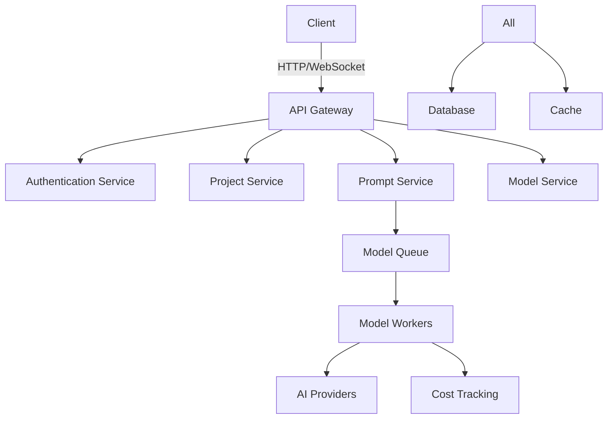

# Architecture Overview

Dataelan is built with a modern, scalable architecture designed to handle AI model orchestration efficiently.

## System Components



## Core Services

### API Gateway
- Request routing
- Rate limiting
- Authentication
- Load balancing

### Authentication Service
- User management
- JWT handling
- Organization management
- Access control

### Project Service
- Project CRUD
- Collaboration
- Resource management
- Activity tracking

### Prompt Service
- Session management
- Prompt execution
- Context handling
- Response processing

### Model Service
- Provider integration
- Model selection
- Cost optimization
- Performance monitoring

## Data Flow

1. **Request Flow**
   ```
   Client -> API Gateway -> Service -> Database
   ```

2. **Model Execution Flow**
   ```
   Prompt -> Queue -> Worker -> Provider -> Response
   ```

3. **Event Flow**
   ```
   Action -> Event Bus -> Consumers -> Updates
   ```

## Technologies

- **Backend**: Django/Python
- **Database**: PostgreSQL
- **Cache**: Redis
- **Queue**: Celery
- **Search**: Elasticsearch
- **Storage**: S3-compatible

## Security

- JWT authentication
- Role-based access
- API key management
- Request signing
- Data encryption
- Audit logging

## Scalability

- Horizontal scaling
- Load balancing
- Connection pooling
- Query optimization
- Caching strategy
- Background jobs
